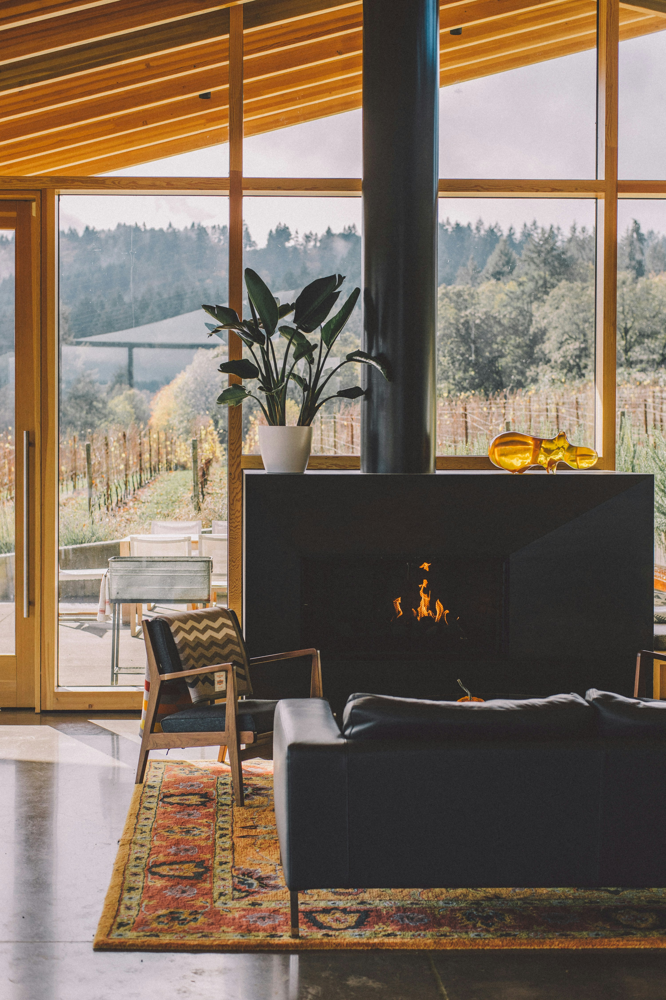
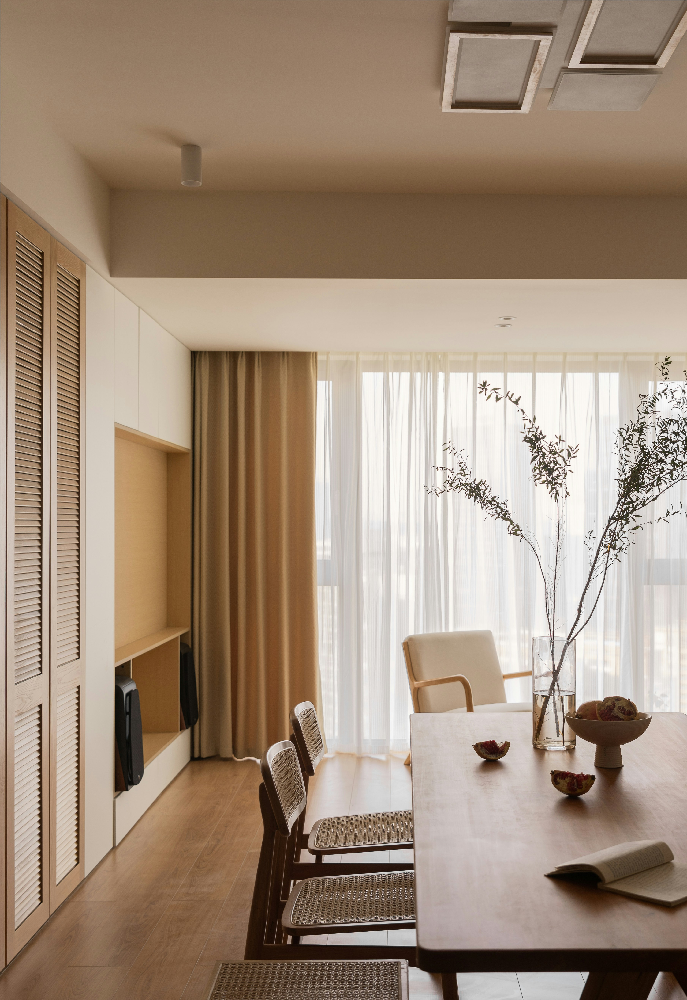

```{=html}
<header class="hdr">
  <a href="index.html" class="logo">AMx</a>
  <nav class="hdr-nav">
    <a href="conseils.html" class="active">Services</a>
  </nav>
  <a href="contact.html" class="hdr-cta">Contact</a>
</header>

<nav class="nav-bar">
  <a href="conseils.html" class="nav-item"><span class="nav-num">01</span> Conseils</a>
  <a href="urbanisme.html" class="nav-item"><span class="nav-num">02</span> Urbanisme</a>
  <a href="projets.html" class="nav-item active"><span class="nav-num">03</span> Projets</a>
  <a href="energie.html" class="nav-item"><span class="nav-num">04</span> Énergie</a>
</nav>

<section class="prestations">
  <div class="prest has-img">
    <div class="prest-left">
      <div class="prest-num">03.1</div>
      <h2 class="prest-title">Projets<br>d'architecture</h2>
      <div class="img-block">
        
      </div>
    </div>
    <div class="prest-right">
      <p class="sec-label">Description</p>
      <p class="text-accroche">Une mission complète, du projet au chantier.</p>
      <div class="prest-desc">
        <p>Je travaille exclusivement sur le bâti existant — rénovation, transformation et extension d'habitations unifamiliales et d'appartements. Chaque intervention part d'une lecture attentive du bâtiment : ce qu'il est, ce qu'il contraint, ce qu'il permet.</p>
        <p>L'enjeu n'est pas de tout repenser, mais de trouver les gestes justes — ceux qui améliorent durablement la qualité des espaces, la lumière, les circulations, sans trahir l'équilibre du lieu. Une rénovation réussie ne s'impose pas au bâtiment : elle révèle ce qu'il avait en lui.</p>
      </div>
      <div class="steps-block">
        <p class="sec-label">La prestation comprend :</p>
        <div class="step"><span class="step-n">•</span><span class="step-t">Analyse du bâtiment et de son potentiel</span></div>
        <div class="step"><span class="step-n">•</span><span class="step-t">Étude des besoins et définition du projet</span></div>
        <div class="step"><span class="step-n">•</span><span class="step-t">Conception architecturale et optimisation des espaces</span></div>
        <div class="step"><span class="step-n">•</span><span class="step-t">Réalisation des plans et du dossier de permis d'urbanisme</span></div>
        <div class="step"><span class="step-n">•</span><span class="step-t">Préparation des documents techniques</span></div>
        <div class="step"><span class="step-n">•</span><span class="step-t">Consultation des entreprises et analyse des offres</span></div>
        <div class="step"><span class="step-n">•</span><span class="step-t">Coordination des intervenants</span></div>
        <div class="step"><span class="step-n">•</span><span class="step-t">Suivi et accompagnement du chantier</span></div>
      </div>
    </div>
  </div>

  <div class="prest has-img">
    <div class="prest-left">
      <div class="prest-num">03.2</div>
      <h2 class="prest-title">Projets<br>d'intérieur</h2>
      <div class="img-block">
        
      </div>
    </div>
    <div class="prest-right">
      <p class="sec-label">Description</p>
      <p class="text-accroche">Des espaces pensés pour votre usage, cohérents et agréables à vivre.</p>
      <div class="prest-desc">
        <p>Lorsque le projet ne nécessite pas de permis, j'interviens à l'échelle de l'intérieur : réorganisation des pièces, optimisation des circulations, choix des matériaux, mobilier sur mesure, conception des espaces de vie.</p>
        <p>L'approche reste la même qu'en architecture — fonctionnelle d'abord, esthétique par cohérence. Chaque décision — une cloison déplacée, un matériau choisi, une proportion ajustée — contribue à un ensemble qui fonctionne bien, longtemps, pour ceux qui l'habitent. Un intérieur réussi n'est pas celui qui impressionne au premier regard, mais celui qu'on ne veut plus quitter.</p>
      </div>
      <div class="steps-block">
        <p class="sec-label">La prestation comprend :</p>
        <div class="step"><span class="step-n">•</span><span class="step-t">Analyse et optimisation des espaces existants</span></div>
        <div class="step"><span class="step-n">•</span><span class="step-t">Réorganisation des pièces et circulations</span></div>
        <div class="step"><span class="step-n">•</span><span class="step-t">Plans d'aménagement intérieur</span></div>
        <div class="step"><span class="step-n">•</span><span class="step-t">Étude de mobiliers sur mesure</span></div>
        <div class="step"><span class="step-n">•</span><span class="step-t">Conseils matériaux, couleurs et ambiances</span></div>
        <div class="step"><span class="step-n">•</span><span class="step-t">Conception de cuisines, séjours et espaces de vie</span></div>
        <div class="step"><span class="step-n">•</span><span class="step-t">Accompagnement dans les choix techniques et esthétiques</span></div>
        <div class="step"><span class="step-n">•</span><span class="step-t">Suivi et accompagnement du chantier</span></div>
      </div>
    </div>
  </div>
</section>

<section class="cta-band">
  <h2 class="prest-title">Prêt à démarrer<br>votre projet ?</h2>
  <a href="contact.html" class="hdr-cta">Prendre contact</a>
</section>

<section class="faq-section">
  <div class="faq-left">
    <div class="prest-num">FAQ</div>
    <h2 class="prest-title">Questions<br>fréquentes</h2>
  </div>
  <div class="faq-right">
  <div class="accordion">
    <div class="acc-item">
      <button class="acc-head" onclick="toggle(this)">
        Quels types de projets prenez-vous en charge ?
        <svg class="acc-icon" viewBox="0 0 24 24" fill="none" stroke-width="1.5" stroke-linecap="round" stroke-linejoin="round"><polyline points="6 9 12 15 18 9"/></svg>
      </button>
      <div class="acc-body">Je me concentre exclusivement sur les habitations existantes : rénovations complètes, transformations, extensions et projets d'aménagement intérieur. Je ne réalise pas de projets de construction neuve.</div>
    </div>
    <div class="acc-item">
      <button class="acc-head" onclick="toggle(this)">
        Prenez-vous en charge des petits projets ?
        <svg class="acc-icon" viewBox="0 0 24 24" fill="none" stroke-width="1.5" stroke-linecap="round" stroke-linejoin="round"><polyline points="6 9 12 15 18 9"/></svg>
      </button>
      <div class="acc-body">Oui. Une mission peut concerner aussi bien une rénovation complète qu'une transformation ciblée, une extension ou un réaménagement intérieur. Chaque projet est adapté en fonction de sa taille et de ses besoins.</div>
    </div>
    <div class="acc-item">
      <button class="acc-head" onclick="toggle(this)">
        Intégrez-vous des matériaux durables ou biosourcés dans les projets ?
        <svg class="acc-icon" viewBox="0 0 24 24" fill="none" stroke-width="1.5" stroke-linecap="round" stroke-linejoin="round"><polyline points="6 9 12 15 18 9"/></svg>
      </button>
      <div class="acc-body">Oui, lorsque le projet s'y prête et en fonction des contraintes techniques et budgétaires. Je privilégie une approche réfléchie des matériaux, en intégrant autant que possible des solutions durables, biosourcées ou à faible impact environnemental, sans compromis sur la cohérence architecturale et la durabilité du projet.</div>
    </div>
    <div class="acc-item">
      <button class="acc-head" onclick="toggle(this)">
        Dans quelle région intervenez-vous ?
        <svg class="acc-icon" viewBox="0 0 24 24" fill="none" stroke-width="1.5" stroke-linecap="round" stroke-linejoin="round"><polyline points="6 9 12 15 18 9"/></svg>
      </button>
      <div class="acc-body">J'interviens principalement à Liège et en périphérie liégeoise. Pour des demandes spécifiques ou des projets situés en dehors de ce périmètre, une étude au cas par cas peut être envisagée.</div>
    </div>
  </div>
  </div>
</section>

<footer class="ftr">
  <a href="mailto:contact@amx-architecture.be" style="font-size:11px;font-weight:500;letter-spacing:0.15em;text-transform:uppercase;color:#71717a;text-decoration:none;">contact@amx-architecture.be</a>
</footer>

<script>
  function toggle(btn) {
    const accordion = btn.closest('.accordion');
    const body = btn.nextElementSibling;
    const icon = btn.querySelector('.acc-icon');
    const isOpen = body.classList.contains('open');
    accordion.querySelectorAll('.acc-body').forEach(b => {
      b.classList.remove('open');
      b.previousElementSibling.querySelector('.acc-icon').classList.remove('open');
    });
    if (!isOpen) {
      body.classList.add('open');
      icon.classList.add('open');
    }
  }
</script>
```
