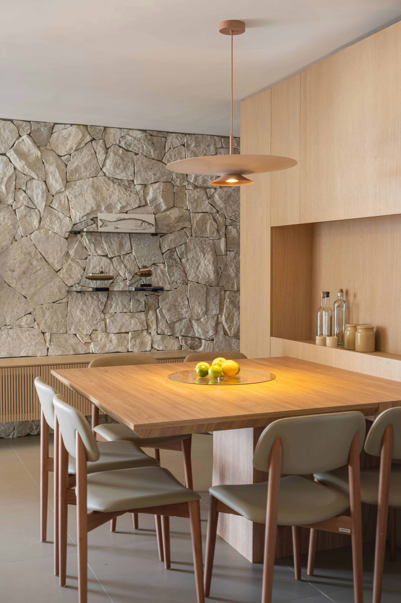
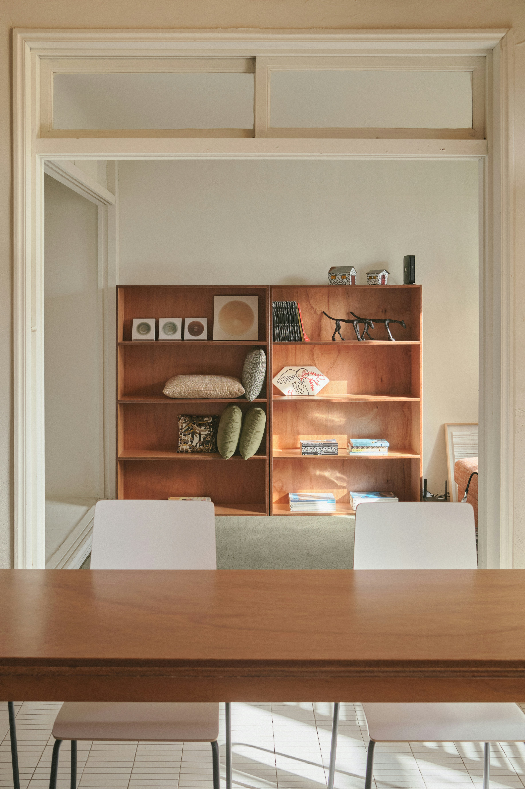

```{=html}
<header class="hdr">
  <a href="index.html" class="logo">AMx</a>
  <nav class="hdr-nav">
    <a href="conseils.html" class="active">Services</a>
  </nav>
  <a href="contact.html" class="hdr-cta">Contact</a>
</header>

<nav class="nav-bar">
  <a href="conseils.html" class="nav-item"><span class="nav-num">01</span> Conseils</a>
  <a href="urbanisme.html" class="nav-item active"><span class="nav-num">02</span> Urbanisme</a>
  <a href="projets.html" class="nav-item"><span class="nav-num">03</span> Projets</a>
  <a href="energie.html" class="nav-item"><span class="nav-num">04</span> Énergie</a>
</nav>

<section class="prestations">
  <div class="prest has-img">
    <div class="prest-left">
      <div class="prest-num">02.1</div>
      <h2 class="prest-title">Permis <br>d'urbanisme</h2>
      <div class="img-block">
        
     </div>
    </div>
    <div class="prest-right">
      <p class="sec-label">Description</p>
      <p class="text-accroche">Obtenir un permis d'urbanisme commence par bien comprendre ce qui est possible.</p>
      <div class="prest-desc">
        <p>Certains projets nécessitent une demande de permis d'urbanisme — avec ou sans intervention obligatoire d'un architecte. Dans les deux cas, chaque demande exige une analyse précise du contexte urbanistique, des réglementations applicables et des exigences propres à l'administration communale.</p>
        <p>Entre les documents à fournir, les plans à constituer et les délais à respecter, les démarches peuvent rapidement devenir complexes et chronophages. Même lorsque le recours à un architecte n'est pas légalement requis, j'accompagne particuliers et professionnels dans la préparation complète de leur dossier pour une demande cohérente, conforme et introduite dans les meilleures conditions.</p>
      </div>

      <div class="steps-block">
        <p class="sec-label">La prestation comprend</p>
        <div class="step"><span class="step-n">•</span><span class="step-t">Analyse de la situation urbanistique du bien</span></div>
        <div class="step"><span class="step-n">•</span><span class="step-t">Vérification de la faisabilité et de la conformité du projet</span></div>
        <div class="step"><span class="step-n">•</span><span class="step-t">Relevé et réalisation des plans de permis d'urbanisme</span></div>
        <div class="step"><span class="step-n">•</span><span class="step-t">Constitution du dossier administratif complet</span></div>
        <div class="step"><span class="step-n">•</span><span class="step-t">Introduction de la demande auprès de l'administration communale</span></div>
        <div class="step"><span class="step-n">•</span><span class="step-t">Suivi et accompagnement tout au long de la procédure</span></div>
      </div> 
    </div>
  </div>

  <div class="prest has-img">
    <div class="prest-left">
      <div class="prest-num">02.2</div>
      <h2 class="prest-title">Permis de<br>régularisation</h2>
      <div class="img-block">
        
     </div>
    </div>
    <div class="prest-right">
      <p class="sec-label">Description</p>
      <p class="text-accroche">Régulariser une situation irrégulière, c'est retrouver une pleine liberté sur son bien.</p>
      <div class="prest-desc">
        <p>Certains biens font l'objet de transformations réalisées sans autorisation ou non conformes au permis initialement octroyé. Une irrégularité non traitée peut bloquer une transaction immobilière, engager la responsabilité du propriétaire ou compromettre de futurs travaux.</p>
        <p>Chaque situation requiert une analyse rigoureuse de l'existant — relevé précis, comparaison avec le permis d'origine, identification des écarts — avant d'engager les démarches appropriées. J'accompagne particuliers et professionnels dans la constitution complète de leur dossier de régularisation, afin de clarifier durablement la situation administrative de leur bien.</p>
      </div>

      <div class="steps-block">
        <p class="sec-label">La prestation comprend</p>
        <div class="step"><span class="step-n">•</span><span class="step-t">Analyse de la situation urbanistique du bien</span></div>
        <div class="step"><span class="step-n">•</span><span class="step-t">Vérification des infractions ou écarts éventuels</span></div>
        <div class="step"><span class="step-n">•</span><span class="step-t">Relevé et réalisation des plans de permis de régularisation</span></div>
        <div class="step"><span class="step-n">•</span><span class="step-t">Constitution du dossier administratif complet</span></div>
        <div class="step"><span class="step-n">•</span><span class="step-t">Introduction de la demande auprès de l'administration communale</span></div>
        <div class="step"><span class="step-n">•</span><span class="step-t">Suivi et accompagnement tout au long de la procédure</span></div>
      </div>      
    </div>
  </div>

</section>

<section class="cta-band">
  <h2 class="prest-title">Un projet ou une<br>situation à clarifier ?</h2>
  <a href="contact.html" class="hdr-cta">Prendre contact</a>
</section>

<section class="faq-section">
  <div class="faq-left">
    <div class="prest-num">FAQ</div>
    <h2 class="prest-title">Questions<br>fréquentes</h2>
  </div>
  <div class="faq-right">
  <div class="accordion">
    <div class="acc-item">
      <button class="acc-head" onclick="toggle(this)">
        Dans quels cas un permis d'urbanisme est-il nécessaire ?
        <svg class="acc-icon" viewBox="0 0 24 24" fill="none" stroke-width="1.5" stroke-linecap="round" stroke-linejoin="round"><polyline points="6 9 12 15 18 9"/></svg>
      </button>
      <div class="acc-body">De nombreux travaux nécessitent un permis d'urbanisme : extension, modification de façade, transformation intérieure avec impact sur la structure, changement de destination, régularisation de travaux existants, etc. La première chose à faire est de prendre contact avec le service urbanisme de votre commune.</div>
    </div>
    <div class="acc-item">
      <button class="acc-head" onclick="toggle(this)">
        Tous les projets nécessitent-ils un architecte ?
        <svg class="acc-icon" viewBox="0 0 24 24" fill="none" stroke-width="1.5" stroke-linecap="round" stroke-linejoin="round"><polyline points="6 9 12 15 18 9"/></svg>
      </button>
      <div class="acc-body">Non. Certains travaux sont dispensés du concours obligatoire à un architecte. Cela ne dispense toutefois pas d'obtenir un permis d'urbanisme lorsque celui-ci est requis. Dans ce cas, le dossier doit respecter les exigences administratives et urbanistiques de la commune. </div>
    </div>
    <div class="acc-item">
      <button class="acc-head" onclick="toggle(this)">
        Pourquoi faire appel à un professionnel si l'architecte n'est pas obligatoire ?
        <svg class="acc-icon" viewBox="0 0 24 24" fill="none" stroke-width="1.5" stroke-linecap="round" stroke-linejoin="round"><polyline points="6 9 12 15 18 9"/></svg>
      </button>
      <div class="acc-body">Les démarches urbanistiques peuvent rapidement devenir techniques et chronophages : réglementation communale, constitution du dossier, plans, échanges avec l'administration, conformité du projet, etc. Être accompagné par un architecte permet de constituer un dossier complet et cohérent, de limiter les erreurs administratives et de faciliter le traitement de la demande.</div>
    </div>
    <div class="acc-item">
      <button class="acc-head" onclick="toggle(this)">
        Qu'est-ce qu'une régularisation urbanistique ?
        <svg class="acc-icon" viewBox="0 0 24 24" fill="none" stroke-width="1.5" stroke-linecap="round" stroke-linejoin="round"><polyline points="6 9 12 15 18 9"/></svg>
      </button>
      <div class="acc-body">C'est une demande de permis d'urbanisme permettant de mettre en conformité des travaux réalisés sans autorisation ou en dehors des conditions du permis initial. Cela peut concerner, par exemple : une annexe ou une véranda construite sans permis, une modification de façade, un changement d'affectation, des transformations réalisées par un ancien propriétaire, etc.</div>
    </div>
    <div class="acc-item">
      <button class="acc-head" onclick="toggle(this)">
        Comment savoir si mon bien doit être régularisé ?
        <svg class="acc-icon" viewBox="0 0 24 24" fill="none" stroke-width="1.5" stroke-linecap="round" stroke-linejoin="round"><polyline points="6 9 12 15 18 9"/></svg>
      </button>
      <div class="acc-body">Une analyse de la situation urbanistique du bien permet de comparer l'état existant avec les autorisations délivrées par la commune. En cas de doute, il est recommandé de vérifier la conformité du bien avant une vente, un achat ou de nouveaux travaux.</div>
    </div>
    <div class="acc-item">
      <button class="acc-head" onclick="toggle(this)">
        Quels sont vos secteurs d'intervention ?
        <svg class="acc-icon" viewBox="0 0 24 24" fill="none" stroke-width="1.5" stroke-linecap="round" stroke-linejoin="round"><polyline points="6 9 12 15 18 9"/></svg>
      </button>
      <div class="acc-body">J'interviens principalement à Liège et en périphérie liégeoise et ponctuellement à Mons. Pour des demandes spécifiques ou des projets situés en dehors de ce périmètre, une étude au cas par cas peut être envisagée.</div>
    </div>
  </div>
  </div>
</section>

<footer class="ftr">
  <a href="mailto:contact@amx-architecture.be" style="font-size:11px;font-weight:500;letter-spacing:0.15em;text-transform:uppercase;color:#71717a;text-decoration:none;">contact@amx-architecture.be</a>
</footer>

<script>
  function toggle(btn) {
    const accordion = btn.closest('.accordion');
    const body = btn.nextElementSibling;
    const icon = btn.querySelector('.acc-icon');
    const isOpen = body.classList.contains('open');
    accordion.querySelectorAll('.acc-body').forEach(b => {
      b.classList.remove('open');
      b.previousElementSibling.querySelector('.acc-icon').classList.remove('open');
    });
    if (!isOpen) {
      body.classList.add('open');
      icon.classList.add('open');
    }
  }
</script>
```
